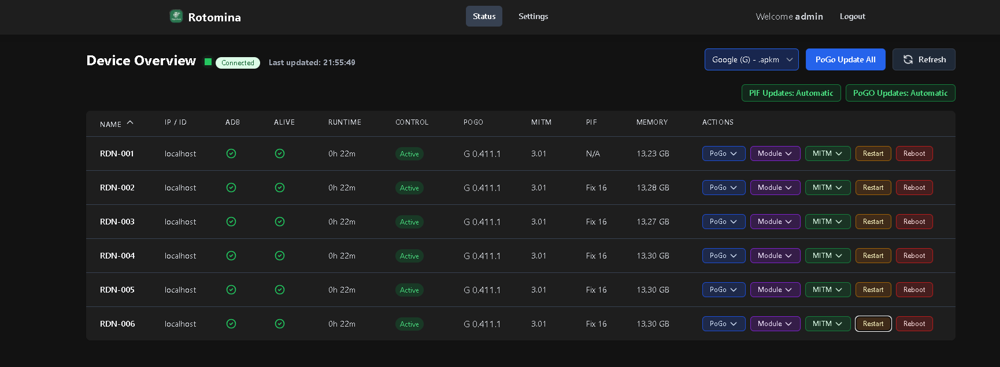

# Rotomina

A comprehensive web-based management and monitoring tool for Android devices with MITM and PlayIntegrityFix support, designed for Pokemon GO automation and management.



## 🏗️ Architecture

Rotomina is built with a modern, scalable architecture:

- **Backend**: FastAPI with async/await support for high-performance concurrent operations
- **Frontend**: Alpine.js for reactive UI with Tailwind CSS for responsive design
- **Real-time Communication**: WebSocket connections for live device status updates
- **Connection Management**: Optimized ADB connection pooling and WebSocket connection reuse
- **Background Tasks**: Scheduled tasks for updates, monitoring, and maintenance
- **Authentication**: Session-based user authentication with secure credentials

## 🚀 Features

- 📱 **Device Management**: Monitor and control multiple Android devices via ADB
- 🔄 **Automatic Updates**: Keep Pokemon GO, MITM apps, and PlayIntegrityFix up-to-date
- � **Real-time Monitoring**: WebSocket-based live status updates with fallback AJAX polling
- � **Discord Bot**: Full two-way control via slash commands and status notifications in Discord
- 🛠️ **Remote Management**: Install apps, modules, and restart services remotely
- 🔐 **Secure Authentication**: User authentication with configurable credentials
- 🌐 **Responsive Design**: Mobile-friendly interface that works on all devices
- 🔧 **Connection Optimization**: Efficient connection pooling to minimize resource usage

## 📋 Requirements

### System Requirements
- Python 3.8+
- ADB (Android Debug Bridge) installed and accessible
- Network access to Android devices

### Device Requirements
- Root access on Android devices
- Magisk installed
- PlayIntegrityFix module
- MITM apps compatible with Pokemon GO
- Network connectivity (WiFi or USB connection)

## 🛠️ Installation

### Quick Start (Using Docker Compose) - Recommended

The easiest way to run Rotomina is using Docker Compose with pre-built image:

1. **Download the standalone configuration:**
```bash
curl -O https://raw.githubusercontent.com/f3ger/rotomina/main/docker-compose-standalone.yml
mv docker-compose-standalone.yml docker-compose.yml
```

2. **Create necessary directories:**
```bash
mkdir -p data
```

3. **Start Rotomina:**
```bash
docker-compose up -d
```

4. **Complete the setup wizard** — on first launch, a setup wizard will guide you through creating your admin account.

5. **Access the web interface** at http://localhost:8000

### Alternative Installation Methods

#### Docker Run Command
```bash
docker run -d \
  --name rotomina \
  --restart unless-stopped \
  -p 8000:8000 \
  -v $(pwd)/data:/app/data \
  --privileged \
  ghcr.io/f3ger/rotomina:latest
```

#### Building from Source
```bash
# Clone the repository
git clone https://github.com/f3ger/rotomina.git
cd rotomina

# Build and run with Docker Compose
docker-compose build
docker-compose up -d
```

#### Manual Installation (Advanced)
```bash
# Clone repository
git clone https://github.com/f3ger/rotomina.git
cd rotomina

# Create virtual environment
python -m venv venv
source venv/bin/activate  # On Windows: venv\Scripts\activate

# Install dependencies
pip install -r requirements.txt

# Start the server
uvicorn main:app --host 0.0.0.0 --port 8000
```

## ⚙️ Configuration

### Initial Setup
On first run, a setup wizard will guide you through creating your admin account. The `config.json` file is generated automatically — all configuration is managed through the web UI (Settings page).

### Device Management
Add devices via the web interface using:
- **IP Address**: For network-connected devices (format: `IP:PORT`, e.g., `192.168.1.100:5555`)
- **ADB Device ID**: For USB-connected devices (format: `DEVICE_ID`, e.g., `11131FDD4001BU`)

### Configuration Options
- `memory_threshold`: Memory limit in MB before automatic restart
- `pogo_auto_update_enabled`: Auto-update Pokemon GO when new versions available
- `pif_auto_update_enabled`: Auto-update PlayIntegrityFix module
- `discord_bot_token`: Bot token from the Discord Developer Portal
- `discord_bot_channel_id`: Channel ID where slash commands are accepted (optional)
- `discord_bot_role_id`: Role ID required to execute bot commands (optional)
- `discord_bot_notify_channel_id`: Channel ID for status notifications (optional)
- `device_token`: Authentication token for external API access

## 🎯 Usage

### Getting Started
1. **Access the web interface** at `http://your-server-ip:8000`
2. **Complete the setup wizard** to create your admin account
3. **Add devices** in the Settings page
4. **Monitor and manage** devices from the Status page

### Status Page Features
The Status page provides comprehensive device information:
- **Connection Status**: Online/Offline with real-time updates
- **Memory Usage**: Current memory consumption with visual indicators
- **Installed Versions**: Pokemon GO, MITM, and module versions
- **Update Controls**: Manual update triggers for each component
- **Runtime Tracking**: How long devices have been running
- **Device Controls**: Restart, update, and manage individual devices

### WebSocket Communication
- **Primary Connection**: WebSocket for real-time updates (`ws://host:8000/ws/status`)
- **Fallback Mechanism**: AJAX polling every 60 seconds if WebSocket fails
- **Connection Pooling**: Optimized connection reuse to minimize overhead
- **Automatic Reconnection**: Handles connection drops gracefully

### API Endpoints
- `GET /api/status`: Device status and system information
- `GET /api/all-module-versions`: Available module versions
- `POST /devices/add`: Add new device
- `POST /devices/remove`: Remove device
- `WebSocket /ws/status`: Real-time status updates

## 🤖 Discord Bot

Rotomina includes a Discord bot for two-way control: trigger updates and restarts via slash commands, and receive status notifications — all from within your Discord server.

### Step 1 — Create the Bot

1. Go to the [Discord Developer Portal](https://discord.com/developers/applications) and click **New Application**
2. Give it a name (e.g. `Rotomina`) and confirm
3. Open the **Bot** tab → click **Add Bot** → confirm
4. Under **Token** click **Reset Token**, copy it and save it somewhere safe
5. Privileged Gateway Intents are **not required** — leave all toggles off

### Step 2 — Invite the Bot to Your Server

1. Open the **OAuth2** tab → **URL Generator**
2. Select scopes: `bot` and `applications.commands`
3. Select bot permissions: **Send Messages**, **Embed Links**, **View Channels**
4. Copy the generated URL, open it in a browser, and select your server

### Step 3 — Get Channel and Role IDs

Enable **Developer Mode** in Discord:
> User Settings → Advanced → Developer Mode → On

- **Channel ID**: Right-click any channel → *Copy Channel ID*
- **Role ID**: Server Settings → Roles → right-click the role → *Copy Role ID*

### Step 4 — Configure Rotomina

Open **Settings** in the Rotomina web UI and fill in the **Discord Bot** section:

| Field | Description |
|-------|-------------|
| **Bot Token** | The token from Step 1 |
| **Allowed Command Channel** | Channel ID where slash commands are accepted. Leave empty to allow any channel. |
| **Allowed Role** | Role ID required to use bot commands. Leave empty to allow all users. |
| **Notification Channel** | Channel ID where the bot posts status alerts. Leave empty to disable notifications. |

> **Note:** A server restart is required after changing the bot token.

### Slash Commands

| Command | Description |
|---------|-------------|
| `/update_pogo` | Starts a PoGo update on all configured devices. Reports back when done. |
| `/status` | Shows all devices as a rich embed with ADB status, PoGo version, and free RAM. |
| `/restart` | Restarts PoGo/MITM on all devices. Reports back when done. |

> **Note:** Slash commands are synced globally on bot startup. It can take **up to 1 hour** for them to appear in Discord after the first start.

### Notification Events

The bot posts embedded alerts to the configured notification channel for:

| Event | Color |
|-------|-------|
| Device went offline | 🔴 Red |
| Device back online | 🟢 Green |
| Low memory — app restarted | 🟠 Orange |
| New version downloaded | 🔵 Blue |
| Update installed successfully | 🟢 Green |
| Installation failed / retry | 🔴 / 🟠 |
| Invalid device token | 🔴 Red |

## 🔄 Updating

### Docker Updates
```bash
# Pull latest image and restart
docker-compose pull
docker-compose up -d
```

### Source Updates
```bash
# Pull latest changes
git pull origin main

# Rebuild and restart
docker-compose build
docker-compose up -d
```

## 🐛 Troubleshooting

### Common Issues

#### WebSocket Connection Issues
- **Symptom**: Frequent API polling instead of WebSocket updates
- **Solution**: Check firewall settings, ensure port 8000 is accessible
- **Fallback**: System automatically uses AJAX polling if WebSocket fails

#### Device Connection Problems
- **Symptom**: Devices showing as offline
- **Solution**: 
  - Verify ADB is installed and accessible
  - Check network connectivity to device IP
  - Ensure device has USB debugging enabled
  - Confirm device is rooted with Magisk

#### Memory Issues
- **Symptom**: Frequent device restarts
- **Solution**: 
  - Increase `memory_threshold` in config
  - Check for memory leaks in installed apps
  - Monitor device performance logs

#### Update Failures
- **Symptom**: Updates not installing
- **Solution**:
  - Check internet connectivity
  - Verify sufficient storage space
  - Ensure device has proper permissions
  - Review update logs for specific error messages

#### Discord Bot Not Responding
- **Commands not showing up**: Global slash command sync takes up to 1 hour after the first start. Wait and try again.
- **"Not authorized" response**: Verify you are posting in the configured command channel and that your account has the required role set in Settings.
- **Bot appears offline**: The bot token in Settings may be wrong or expired — reset it in the Developer Portal, update Settings, and restart the server.
- **No notifications arriving**: Make sure the Notification Channel ID is set in Settings and that the bot has **Send Messages** and **Embed Links** permissions in that channel.

### Performance Optimization
- **Connection Pooling**: Automatically manages ADB connections efficiently
- **WebSocket Optimization**: Reuses connections to minimize overhead
- **Background Tasks**: Scheduled operations to prevent blocking
- **Memory Management**: Monitors and cleans up stale connections

## 🔒 Security Considerations

- **Admin Account**: Set a strong password during the setup wizard
- **Network Access**: Restrict access to trusted networks
- **API Tokens**: Keep device tokens secure and rotate regularly
- **HTTPS**: Use SSL/TLS in production environments
- **Firewall**: Configure appropriate firewall rules

## 🏗️ Development

### Project Structure
```
rotomina/
├── main.py              # Main FastAPI application
├── templates/           # HTML templates
│   ├── base.html       # Base template with navigation
│   ├── status.html     # Device status dashboard
│   ├── settings.html   # Configuration management
│   └── login.html      # Authentication page
├── static/             # Static assets (CSS, JS, images)
├── data/               # Application data directory
└── config.json         # Auto-generated configuration file
```

### Key Components
- **ConnectionManager**: WebSocket connection pooling and management
- **ADBConnectionPool**: Optimized ADB device connections
- **VersionManager**: Component version tracking and updates
- **DeviceMonitor**: Background device status monitoring
- **UpdateManager**: Automated update orchestration

## 📝 License

This project is licensed under the MIT License - see the LICENSE file for details.

## 🙏 Acknowledgements

- The Pokemon GO community for tools and research
- MITM developers for interception capabilities
- PlayIntegrityFix module developers
- FastAPI framework contributors
- Alpine.js and Tailwind CSS teams

## ⚠️ Disclaimer

This project is not affiliated with Niantic or The Pokémon Company. Use at your own risk and responsibility. Ensure compliance with Pokemon GO Terms of Service and local laws.

## 📞 Support

For issues, feature requests, or contributions:
- **GitHub Issues**: [Create an issue](https://github.com/f3ger/rotomina/issues)
- **Documentation**: Check this README and inline code comments
- **Community**: Join the community discussions
